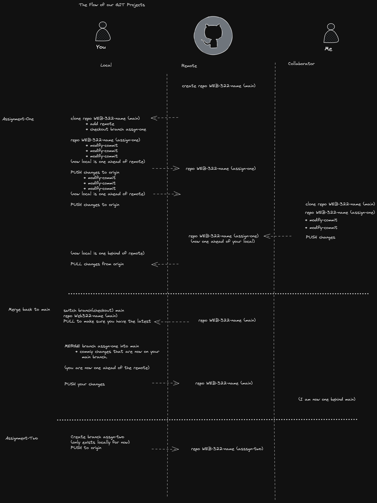

# seneca-web322-fall20233

## Class Notes

Each week I will try to add some notes on what we covered in class/lab and provide sample code where neccesary.

- Week One - [notes](./notes/week-one/README.md)
- Week Two - [notes](./notes/week-two/README.md) - [video](https://seneca-my.sharepoint.com/:v:/g/personal/abhay-mahendera_myseneca_ca/EZ8H5td7JgFNjOtbpZNpH6QBnerU8CgddhLnNuIqoiTVag?e=pS9whZ&nav=eyJyZWZlcnJhbEluZm8iOnsicmVmZXJyYWxBcHAiOiJTdHJlYW1XZWJBcHAiLCJyZWZlcnJhbFZpZXciOiJTaGFyZURpYWxvZyIsInJlZmVycmFsQXBwUGxhdGZvcm0iOiJXZWIiLCJyZWZlcnJhbE1vZGUiOiJ2aWV3In19)
- Week-Three - [notes](./notes/week-three/README.md) -[video](https://seneca-my.sharepoint.com/personal/bruce_christie_senecacollege_ca/_layouts/15/stream.aspx?id=%2Fpersonal%2Fbruce%5Fchristie%5Fsenecacollege%5Fca%2FDocuments%2FRecordings%2FWEB322%20%2D%20Online%20LEcture%2D20230919%5F141840%2DMeeting%20Recording%2Emp4&referrer=Teams%2ETEAMS%2DWEB&referrerScenario=RecapOpenInStreamButton%2Eview%2Eview&ga=1)
- Week-Four
- Week-Five
- Week-Six
- Week-Seven
  ...

## Assignments (50%)

|                                                  | Due Date     | Weight |
| ------------------------------------------------ | ------------ | ------ |
| [Assignent One](./assignments/assignment-one.md) | Sep 18, 2023 | 10%    |
| Assignment Two                                   | Oct 13, 2023 | 10%    |
| Assignment Three                                 | Nov 3, 2023  | 10%    |
| Assignment Four                                  | Nov 27, 2023 | 10%    |
| Assignment Five                                  | Dec 8, 2023  | 10%    |

## Quizzes (50%)

The tests will cover material in [this text](https://webprogrammingtoolsandframeworks.sdds.ca/). Please read it the relevant sections before attending Tuesday's classes.

| Topic      | Test Date    | Weight |
| ---------- | ------------ | ------ |
| Quiz One   | Sep 21, 2023 | 10%    |
| Quiz Two   | Oct 5, 2023  | 10%    |
| Quiz Three | Oct 19, 2023 | 10%    |
| Quiz Four  | Nov 9, 2023  | 10%    |
| Quiz Five  | Nov 23, 2023 | 10%    |
| Quiz Six   | Dec 7, 2023  | 10%    |

**_NOTE: We will only count your top 5 test results._**

Git Notes:

All assignments will be submitted via Github. The basic flow looks like this.

## Extra Practice Reading Watching

[Build 15 JavaScript Projects - Vanilla JavaScript Course](https://www.youtube.com/watch?v=3PHXvlpOkf4)

[10 JavaScript Projects in 10 Hours - Coding Challenge ](https://twitter.com/mdjunaidap/status/1706229900229677086?s=51&t=5_rmBNfqsZ5wjgRNWwrNEg)

[Wed Bos - Javascript 30](https://javascript30.com/)
